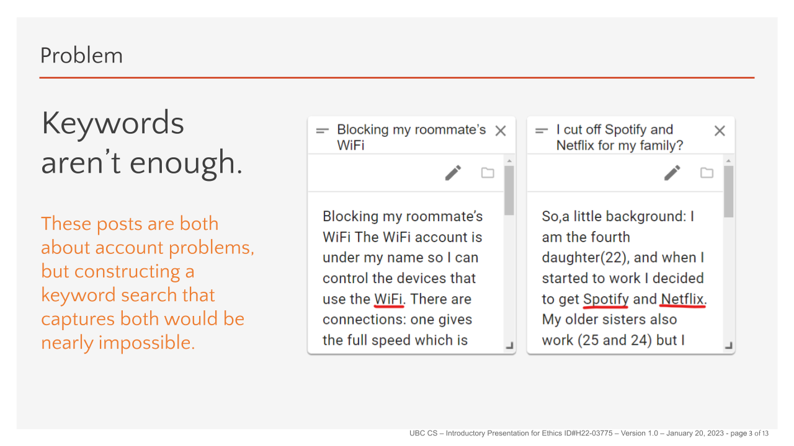
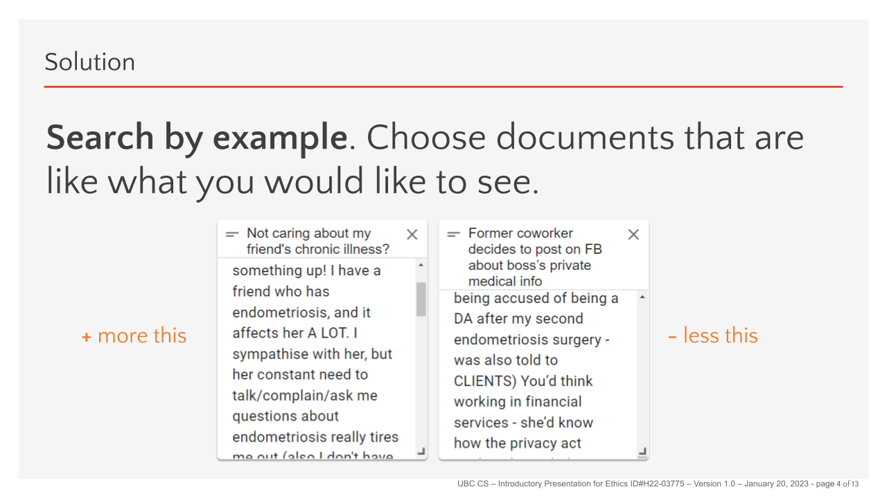
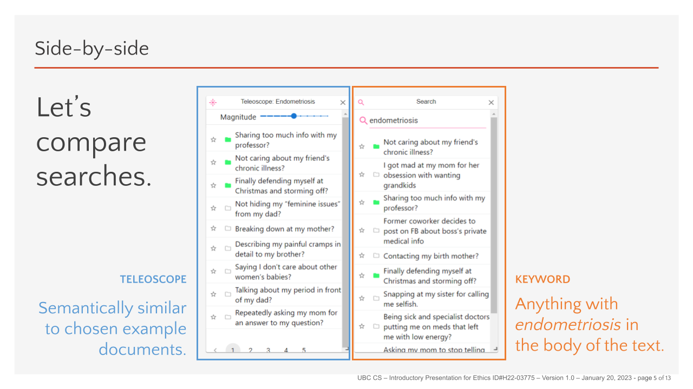
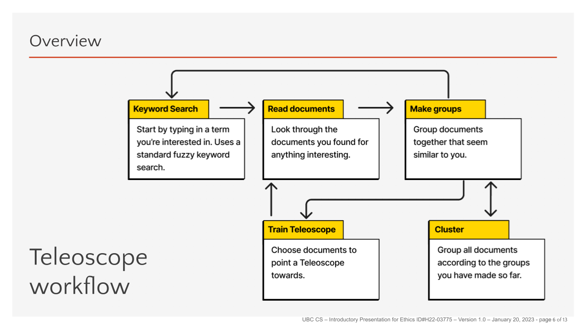

# Teleoscope Overview

Teleoscope is a system for supporting qualitative research with machine learning algorithms. It addresses the problem of having to look through a large corpora of documents (i.e., in the hundreds of thousands) for themes. It works by representing each document as a high-dimensional **dense embedding** from a **[Hugging Face](https://huggingface.co/)** model (the default pipeline uses **[BAAI/bge-m3](https://huggingface.co/BAAI/bge-m3)** via **[FlagEmbedding](https://github.com/FlagOpen/FlagEmbedding)**). Users can interact with documents using a web-based interface by grouping the documents together. When the users group documents, the machine learning system moves a search vector closer to the documents they are adding to the group. The results are displayed to users as a list of documents that are closest to the example documents they have selected to group together.

Teleoscope is the PhD project of [Paul Bucci](https://paulbucci.ca/) who is working with [Prof. Ivan Beschastnikh](https://www.cs.ubc.ca/~bestchai/) from the [Systopia Lab](https://systopia.cs.ubc.ca/) at the [University of British Columbia](https://www.ubc.ca/). Join the [Teleoscope Discord Server](https://discord.gg/GNpjvccnAX) for questions, discussions, and feature requests for Paul. Check out our [Youtube Playlist](https://www.youtube.com/playlist?list=PLfTo3bBE97a0_GllWl9RzzPb9GpwRuayP) for a tutorial on how to use Teleoscope.

## Live demo and documentation ([teleoscope.ca](https://teleoscope.ca))

The hosted app and user-facing docs are on **[teleoscope.ca](https://teleoscope.ca)**:

| | |
| --- | --- |
| **[Demo](https://teleoscope.ca/demo)** | Public, no-login workspace with the pre-seeded corpus (search, documents, vector ranking)—requires demo data on the server. |
| **[Get started](https://teleoscope.ca/get-started)** | Sign up, workspaces, uploads, and basic usage. |
| **[Documentation](https://teleoscope.ca/resources)** | Tutorials, lessons, examples, methodology, and reference. |
| **[Citations](https://teleoscope.ca/academics/citations)** | CHI ’26 and arXiv citation formats. |

Local installs use the same routes on **http://localhost:3000** (see [Installation](#installation)).



The problem that Teleoscope addresses is that keyword searches are based on textual similarities between words. However, we want semantic similarities to be the basis of our searches. The above figure (which is an annotated screenshot of the interface) depicts a conceptual similarity between WiFi and Netflix in that they are both types of accounts that people often share among family and friends. A keyword search could not capture the similarity between those concepts. But our Teleoscope system can by using those semantic document embeddings.



To develop themes, users start with a keyword search, but then start to search by example. The above figure depicts two documents that were found when searching for “endometriosis” as a keyword. However, if the user was attempting to develop a theme based on personal relationships rather than workplace conflicts, they could move the Teleoscope search vector closer to the left document by adding it to a group and selecting it.



As shown in the above figure, that will give a set of results that are more semantically similar to the selected document, which, in this case, shows documents that are about endometriosis AND relationships, but without having to explicitly search for those two terms as keywords.



The workflow for developing themes is as shown in the above figure. The user iteratively searches for keywords, reads the relevant documents, groups them together and selects the documents to train the Teleoscope system with, then repeats. There is also an experimental clustering feature that allows you to use the system to create groups automatically based on the groups you have given it so far.

## Research summary and citation

Teleoscope targets a growing practice in HCI, healthcare, and the social sciences: **qualitative inquiry over very large text corpora** (for example, social media at Reddit scale, on the order of 100K–1M posts). At that scale, teams often resort to **statistical subsampling** before any close reading. That shortcut can be **epistemically misaligned** with interpretivist qualitative work, which depends on context, reflexivity, positionality, and staying “close to the data.”

The CHI 2026 paper frames Teleoscope as scaffolding for **thematic curation**: an **inductive, interpretive** way to shrink a huge corpus *before* full analysis. Researchers start from **keyword search**, then iteratively organize the workspace—documents, groups, and chained similarity operations driven by **semantic embeddings**—so that exploration stays document-centered rather than reduced to corpus-level dashboards alone. The intended output is a **thematic schema**: a curated subset of documents together with a **traceable** record of how items were connected and refined, making **provenance** and **team discussion** of alternative curation paths easier before formal coding and analysis.

The work reports a multi-year **research-through-design** process, including extended formative study with a simulated research team, a field deployment with a qualitative team in nursing, and a public cloud deployment that informed product-facing needs. Contributions are methodological (**thematic curation** and **thematic schemas**), systems-oriented (open, collaborative curation tooling), and empirical (findings from those deployments—for example around serendipitous keyword discovery, confidence in saturation, and collaborative comparison of interpretive lenses).

**Please cite the conference paper (primary):**  
Patrick Yung Kang Lee, Paul Hendrik Bucci, Leo Itsuki Foord-Kelcey, Alamjeet Singh, and Ivan Beschastnikh. 2026. *Crystallizing Schemas with Teleoscope: Thematic Curation of Large Text Corpora on Reddit.* In *Proceedings of the 2026 CHI Conference on Human Factors in Computing Systems (CHI ’26)*, April 13–17, 2026, Barcelona, Spain. ACM, New York, NY, USA, 20 pages. [https://doi.org/10.1145/3772318.3791310](https://doi.org/10.1145/3772318.3791310)

**Earlier extended preprint** (related manuscript; title differs slightly): [arXiv:2402.06124](https://arxiv.org/abs/2402.06124). Ready-to-paste BibTeX and Vancouver entries: **[teleoscope.ca/academics/citations](https://teleoscope.ca/academics/citations)** (source in repo: `teleoscope.ca/src/pages/academics/citations.mdx`).

## Repository map (where to look first)

Use this as the quick orientation guide before editing:

| Path | Purpose | Status |
|---|---|---|
| `teleoscope.ca/` | Active Next.js app (UI + API routes + Playwright/Vitest tests) | Active |
| `backend/` | Python workers/tasks/vector pipeline | Active |
| `scripts/` | One-click stack/test/demo helper scripts | Active |
| `tests/` | Python backend tests and e2e pipeline tests | Active |
| `docs/` | Developer runbooks (Docker, testing); **user docs** live on [teleoscope.ca/resources](https://teleoscope.ca/resources) | Active |
| `schemas/` | Data schemas consumed by app/backend | Active |
| `.github/workflows/` | CI workflows | Active |
| `frontend/` | Older/legacy frontend app | Legacy |
| `backend/archive/` | Historical backend utilities | Legacy |

For contributor workflow and "where to put changes", see `CONTRIBUTING.md`.

## Installation

### Option 1: Docker (quickest)

**AWS EC2:** step-by-step (instance sizing, security groups, `.env`, HTTPS) is in **[docs/ec2-install.md](docs/ec2-install.md)**.

Get the full stack running with one command:

```bash
cp .env.example .env
docker compose up -d
```

The app will be at **http://localhost:3000**. MongoDB, RabbitMQ, Milvus, and all workers (dispatch, graph, vectorizer, uploader, tasks, files API) start automatically. The **vectorizer** loads its embedding model when someone is in a workspace (including **/demo**); after **5 minutes** without workspace activity it stops consuming and unloads to free RAM (`VECTORIZER_IDLE_SECONDS`, default 300). Set **`VECTORIZER_ALWAYS_ON=1`** to keep the legacy always-on consumer (e.g. some CI or unattended setups). After the stack is up, run `./scripts/test-stack.sh` to verify connectivity.
If Milvus host port `19530` is already in use, Docker now auto-assigns a free host port; run `docker compose port milvus 19530` to inspect it, or set `MILVUS_HOST_PORT` in `.env` for a fixed port.

**Conference demo mode (public/no-login):**

- Run `./scripts/one-click-demo.sh`. It starts the stack, **downloads the demo data**, and **seeds the demo corpus** into Mongo and Milvus. The app finds the corpus by the workspace label "Demo corpus" (no need to set `DEMO_CORPUS_WORKSPACE_ID`; one-click may still write it to `.env` to skip a DB lookup). No extra steps.
- Open **http://localhost:3000/demo** (or the hosted **[teleoscope.ca/demo](https://teleoscope.ca/demo)** when available). You land in an anonymous workspace (no login) with the **pre-seeded document corpus** (search, documents, vector ranking). The demo always uses this data; it is part of the install.

**Tests:** CI includes fast frontend/backend checks plus a chunked full-stack Playwright workflow (`.github/workflows/test.playwright.yml`) with separate core/demo and vectorization jobs: PRs run the stable core/demo bundle, while scheduled/manual vectorization runs execute both 10-doc and 100-doc passes to keep runtime bounded while preserving coverage. Also includes a demo API load smoke test. Modular frontend tests run with `cd teleoscope.ca && pnpm test:unit`, and API/frontend contract alignment checks run with `tests/api-frontend-contract.spec.ts` + `tests/api.spec.ts` (see [TESTING.md](TESTING.md)).

> **Note:** First run will take several minutes to build images and pull the embedding model. For GPU acceleration (NVIDIA), use:
> ```bash
> docker compose -f docker-compose.yml -f docker-compose.gpu.yml up -d
> ```
> Requires [nvidia-container-toolkit](https://docs.nvidia.com/datacenter/cloud-native/container-toolkit/install-guide.html).

#### Demo corpus (pre-seeded data) — included in Docker demo

The **/demo** route sends visitors to an anonymous workspace that **always** uses a pre-seeded document corpus (search, open docs, vector ranking). Try it live at **[teleoscope.ca/demo](https://teleoscope.ca/demo)** when that deployment is seeded; locally it is **http://localhost:3000/demo** after you run the steps below. Demo materials are **pre-vectorized** (parquet); the seed script loads them into Mongo and Milvus and does not run the vectorization pipeline. No upload or vectorization in the UI.

- **Docker / one-click demo:** `./scripts/one-click-demo.sh` does everything: starts the stack, runs `./scripts/download-demo-data.sh`, runs the seed script (requires mamba/conda env `teleoscope` with `pyarrow` and `py7zr` on the host), and restarts the app. The app **auto-discovers** the demo corpus by the workspace label "Demo corpus" in Mongo; one-click may write `DEMO_CORPUS_WORKSPACE_ID` to `.env` when the seed prints an ID (optional). The demo at **http://localhost:3000/demo** or **[teleoscope.ca/demo](https://teleoscope.ca/demo)** then has the corpus. No options; it’s part of the install.

- **Manual setup (e.g. no Docker or re-seeding):** If you run the stack yourself or need to re-seed:
  1. Download: `./scripts/download-demo-data.sh` (puts `documents.jsonl.7z` and `parquet_export/` in `data/`).
  2. Seed: `mamba activate teleoscope` then `PYTHONPATH=. python scripts/seed-demo-corpus.py` (use Mongo/Milvus URIs for your stack). The script prints a workspace ID. If `data/` has no demo JSONL/7z yet, it runs `download-demo-data.sh` (clone [teleoscope-demo-data](https://github.com/Teleoscope/teleoscope-demo-data); needs git + bash). **Use only for demo/local/staging**—never against production after real data exists (see `docs/demo-corpus-setup.md`).
  3. Optional: set `DEMO_CORPUS_WORKSPACE_ID=<that_id>` in `.env` to avoid a DB lookup; if unset, the app finds the corpus by the workspace label "Demo corpus". Restart the app.

- **Update only** (no package or data download): run `./scripts/refresh-demo-corpus.sh` when the stack and data are already in place. Does not rebuild images or re-download demo data; run `git pull` first for latest code.
- **Clean install** (full rebuild and re-download): run `CLEAN_INSTALL=1 ./scripts/one-click-demo.sh`.

Full steps, env vars, and troubleshooting (e.g. mamba/micromamba env paths): [docs/demo-corpus-setup.md](docs/demo-corpus-setup.md).

### Option 2: Ansible (VM deployment)

For production or VM deployment:

1. Copy the example vars and inventory:
   ```bash
   cp ansible/vars/vars.yaml.example ansible/vars/vars.yaml
   cp ansible/vars/inventory.yaml.example ansible/vars/inventory.yaml
   ```

2. Edit `ansible/vars/vars.yaml` with your MongoDB, RabbitMQ, and auth credentials (see [ansible/README.md](ansible/README.md) for a variable cheat sheet and `ansible/vars/vars.yaml.example` for the full template).

3. Run the full playbook:
   ```bash
   ansible-playbook -i ansible/vars/inventory.yaml ansible/newteleoscope.yaml
   ```

For a separate vectorizer machine, use `ansible/newvectorizer.yaml`.

### Option 3: Frontend-only development

Run the active web app (`teleoscope.ca`) against a remote backend:

```bash
cd teleoscope.ca
cp ../.env.example .env.local
# Edit .env.local with your backend URLs
pnpm install && pnpm schema && pnpm dev
```

### Option 4: Local stack without Docker (e.g. macOS in UTM)

If you can't run Docker (e.g. hypervisor limits in a VM), run and test everything except the vector pipeline on this machine:

1. **One-time:** `./scripts/setup-local-macos.sh` then `brew services start mongodb-community rabbitmq`
2. **Start stack:** `mamba activate teleoscope && ./scripts/start-local-stack.sh`
3. **Test:** Unit tests (pytest, vitest), `./scripts/test-stack.sh`, and Playwright for non-vector flows.

Vector search and embedding require Milvus (no native macOS server); those are tested in CI or on a host with Docker. See [docs/testing-without-docker.md](docs/testing-without-docker.md).

To run the **demo with a pre-seeded corpus** on this machine (Mongo only; list/search work, vector ranking needs Milvus elsewhere): follow [Demo corpus (pre-seeded data)](#demo-corpus-pre-seeded-data)—download demo data, `mamba activate teleoscope` then `PYTHONPATH=. python scripts/seed-demo-corpus.py` without Milvus env vars, then start the app (the app auto-discovers the corpus by workspace label "Demo corpus"; setting `DEMO_CORPUS_WORKSPACE_ID` is optional).

### Mamba/Conda environment

If you use [mamba](https://mamba.readthedocs.io/) (or conda) to manage Node/Python per project:

```bash
mamba env create -f environments/environment.yml
mamba activate teleoscope
```

This gives you Node 22, pnpm, and Python 3.11 in an isolated env. Then run `pnpm install` in `teleoscope.ca` and `pip install -r backend/requirements.txt` for full backend deps.

**Repo-root Python (`scripts/*.py`, pytest):** activate the env first (`mamba activate teleoscope`), then prefix commands with `PYTHONPATH=.` from the repo root. The env supplies packages (`pymongo`, `pymilvus`, `pytest`, …); `PYTHONPATH=.` is what lets `import backend` resolve without installing the tree as a package. CI uses a pip-installed venv the same way and sets `PYTHONPATH` in workflows.

# Technical notes
Teleoscope is designed from the ground-up to make use of distributed and cloud-based computing. This means that there is a steep learning curve for people who would like to become involved in the project. If you are just getting started, here are some of the technologies that you will need to learn:

## Frontend: React, NextJS, and MUI
The frontend is built using [React](https://reactjs.org/) via the [NextJS](https://nextjs.org/) framework. Most components are customizations of [MUI](https://mui.com/) components. Our interaction and windowing system is based on [React Flow](https://reactflow.dev/).

If you'd like to get started developing for the Teleoscope frontend, create a starter project (e.g., [by following the NextJS tutorials](https://nextjs.org/learn/foundations/about-nextjs)) and add in MUI components. Next, try a [Redux](https://redux.js.org/) tutorial to see how to manage local frontend state.

## Backend: MongoDB, RabbitMQ, and Celery
The technologies that allow us to create a distributed processing system are [RabbitMQ](https://www.rabbitmq.com/) and [Celery](https://docs.celeryq.dev/en/stable/index.html). After installing, work through the examples in the [Celery starter guide](https://docs.celeryq.dev/en/stable/getting-started/introduction.html).

Our database is [MongoDB](https://www.mongodb.com/). After installing MongoDB, you can install [MongoDB Compass](https://www.mongodb.com/products/compass) as a graphical user interface for searching through the database.

## Machine Learning: Hugging Face embeddings, UMAP, and HDBSCAN
The vectorization worker encodes document text with a Hugging Face embedding model loaded through FlagEmbedding (default **`BAAI/bge-m3`**, 1024-dimensional dense vectors). That yields similarity structure for text that may be sparse in your own corpus. When users have created groups, we then perform dimensionality reduction with [UMAP](https://umap-learn.readthedocs.io/en/latest/supervised.html).

You can think of it like this: when the user creates a group, they are saying that they believe that the documents are similar, whether or not the base embedding model would place them very close together. Rather than fine-tuning a new model from scratch, we reduce dimensions with a custom distance metric that says “documents in the same group should end up close when dimensions are cut.” The space is then transformed without a full retraining run. Then, we perform clustering using [HDBSCAN](https://hdbscan.readthedocs.io/en/latest/how_hdbscan_works.html) and present the machine-created clusters to users. If they like the clusters, they can add them as groups and re-run the clustering.

## Cloud-first design
Teleoscope is deployable to new VMs with [Ansible](https://www.ansible.com/). Example `vars.yaml` fields, inventory notes, and playbook entrypoints are in **[ansible/README.md](ansible/README.md)**. For step-by-step install commands, see [Option 2: Ansible (VM deployment)](#option-2-ansible-vm-deployment) above.
